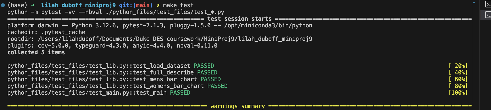

# Mini-Project 9: Cloud-Hosted Notebook Data Manipulation
---
##### The purpose of this project is to build a cloud-hosted notebook using Google Colab, generate a simple data exploration and analysis using a dataset, and return a project in a GitHub repo that contains a CI/CD pipeline and functioning tests. In this project, we will be exploring and analyzing a free Kaggle dataset the contains information about the average hourly wages for different levels of education, over a span of 50 years (1973-2022). The data is then further broken down by sex and race, allowing for demographics comparison of average pay by education level. The analyses provided compare the average hourly wage based on education level, for 2022 and 1973 (the limits of the dataset), and continue to show the differences in average hourly wages between all men and women who have earned a bachelors or advanced degree.
---
### Requirements
- [x] Set up a cloud-hosted Jupyter Notebook (e.g., Google Colab)
- [x] Perform data manipulation tasks on a sample dataset
- [x] Setup and configuration (20 points)
- [x] Data manipulation tasks (20 points)
- [x] CI/CD pipeline (10 points)
- [x] Link to the cloud-hosted notebook
- [x] Document or video demonstrating the tasks performed

---
### File Structure
- Project Folder
    - .devcontainer
        - devcontainer.json
        - Dockerfile
    - .github
        - main.yml
    - data
        - wages_by_education.csv
    - python files
        - outputs
            - wages_men.jpg
            - wages_women.jpg
        - tests
            - test_lib.py
            - test_main.py
        - lib.py
        - main.py
    - Makefile
    - Mini9_Data_Analysis.ipynb (linked to Google Colab)
    - README.md
    - requirements.txt
---
### Data Cleaning and Exploration
##### To begin, we imported our dependencies, and used pandas to load the url into a dataframe. We ensured that it succeeded by running a few assert statements. Next, we checked to see our column names, and if there were any null or missing numbers in the data. By running data.head() and data.tail(), we were able to see the first and last five rows of the dataframe. We confirmed that the first year was 1973, and the last (most recent year) was 2022. We also created a list of our column titles, and saw that the dataframe contained information about: wages by education level, wages by education level and sex, and wages by education level, sex, and race. Finally, we checked to see if there were any null or missing values in the data. 

##### We established that there were no missing values in this dataset, and continued to the data exploration and analysis. The purpose of the data exploration was to generate summary statistics, including the count, mean, standard deviation, mix, max, 25%, 50%, and 75% of some sample columns.

| Statistic|    year    | less_than_hs  |  high_school | some_college | bachelors_degree | advanced_degree |
|----------|------------|---------------|--------------|--------------|------------------|-----------------|
|   count  |  50.00000  |   50.000000   |   50.000000  |   50.000000  |     50.000000    |    50.000000    |
|   mean   |  1997.500  |   15.702600   |   20.876600  |   23.219200  |     34.768600    |    43.899000    |
|   std    |  14.57738  |   1.125252    |   0.742743   |   0.776425   |      3.306645    |     5.305794    |
|   min    |  1973.000  |   13.950000   |   19.620000  |   22.040000  |     30.040000    |    35.320000    |
|   25%    |  1985.250  |   14.885000   |   20.392500  |   22.545000  |     31.875000    |    38.757500    |
|   50%    |  1997.500  |   15.340000   |   20.855000  |   23.185000  |     34.205000    |    44.085000    |
|   75%    |  2009.750  |   16.497500   |   21.480000  |   23.697500  |     37.122500    |    47.557500    |
|   max    |  2022.000  |   18.060000   |   22.700000  |   25.440000  |     41.650000    |    53.740000    |

---
### Data Analysis
##### During the data analysis section, we created a number of plots in the cloud notebook, that provided information about the differences in hourly wages by year, by gender, by education level, and by race. The full analysis can be read in the Mini9_Data_Analysis notebook, but below I will show some sample plots and the results found. 

#### Average Hourly Wage for Men, by Education Level

##### This plot depicts the average hourly wages separated by education level for men in the US. Men who hold advanced degrees earn the highest hourly wage among all education levels, and men who did not complete high school earn the least hourly wage. In around 1980, pay began to steadily increase over time for people who held either a bachelors or a masters degree, while the average pay for those with some college experience or less remained around the same amount.

#### Average Hourly Wage for Women, by Education Level

##### This plot depicts the average hourly wages separated by education level for women in the US. Similar to the men's plot, women who hold advanced degrees earn the highest hourly wage among all education levels, and women who did not complete high school earn the least hourly wage. Compared to the mens' plot however, the range of specific pay values appears to be less for women - men who hold advanced degrees earned over $60/hr in 2022, while women with equivalent degrees earned just over $45/hr.

---
### Conclusions about the Analysis and Recommendations
##### Based on these sample plots, we are able to see how much of a difference there is in average hourly wages between men and women who hold equivalent degrees, over a span of 50 years. This data shows us that the wage gap problem is not new, and in fact has continued to worsen over the past 50 years. This analysis can help influence further research on the wage gap, and hopefully inform policies aimed at reducing the gap. 